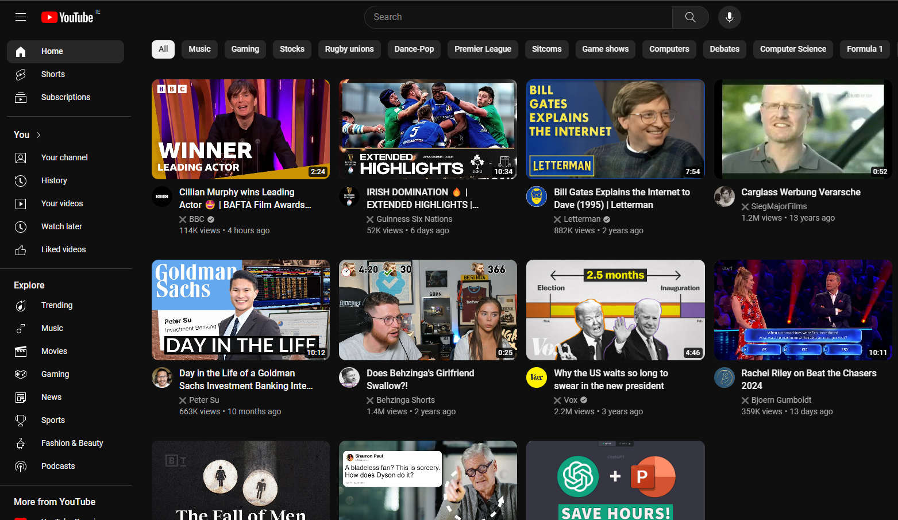
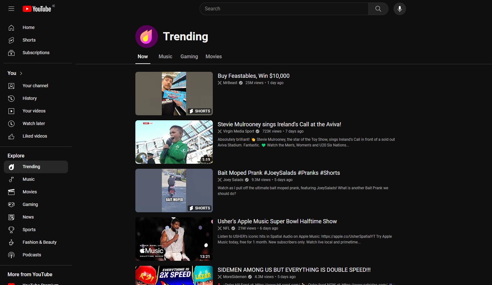
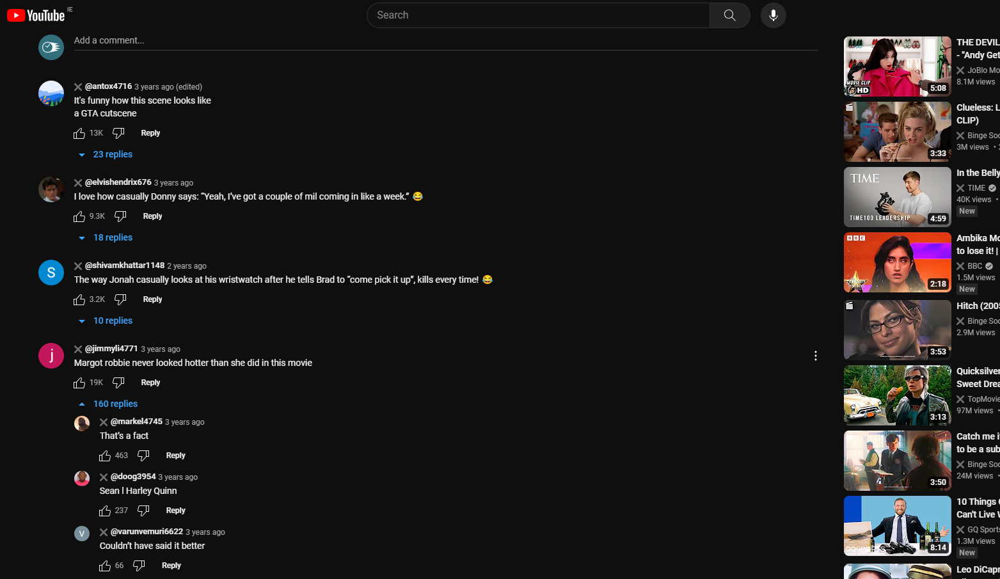
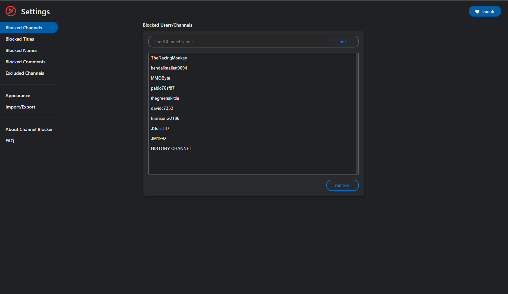

<p align="center"></p>

<h2 align="center"><b>ChannelQuarantine</b></h2>

<p align="center">A maintained fork of Channel Blocker that quarantines unwanted YouTube channels, videos, and comments with blocklists or regular expressions.</p>

---

### About this Extension

ChannelQuarantine keeps your YouTube experience clean. Block entire channels, individual videos, or specific commenters with one click, or build powerful blocklists using regular expressions. No user data is collected.

### What's new in this fork?

- Hide sponsored tiles across the YouTube homepage and search results.
- Hide Shorts shelves for a calmer browsing experience.
- Hide news and topic (rich) shelves when you want a trimmed-down feed.

This project is maintained by [Hackman238](https://github.com/Hackman238) and is based on the original Channel Blocker by Time Machine Development. The project continues to be distributed under the BSD 3-Clause licence.

---

### Screenshots

<p align="center">
    
    
    
    
</p>

## Getting Started

### Installation

Before you begin, ensure that you have [downloaded and installed Node.js and npm](https://nodejs.org/en/download/).

This repository contains three npm workspaces: `content-scripts`, `service-worker`, and `ui`.

Install all dependencies with:

```
./setup.sh
```

### Building the Extension

Build the complete extension bundle with:

```
./build.sh
```

The build outputs will be written to:

- `dist/` – Chromium/Chrome-compatible unpacked build
- `dist-firefox/` – Firefox-compatible unpacked build
- `bin/` – zipped artifacts (`ytc.zip` and `ytc.xpi`)

---

### Contributing & Support

Issues and pull requests are welcome at [github.com/Hackman238/ChannelQuarantine](https://github.com/Hackman238/ChannelQuarantine). If you run into problems, please open an issue with steps to reproduce and any relevant console output.
