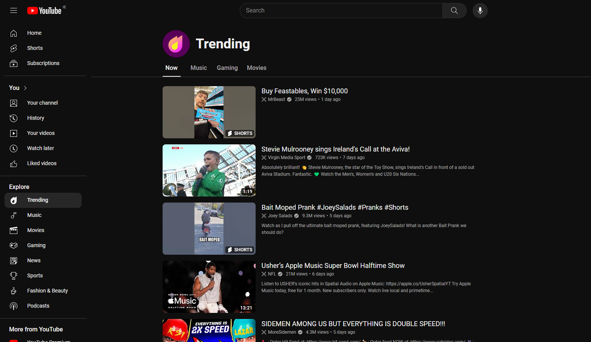
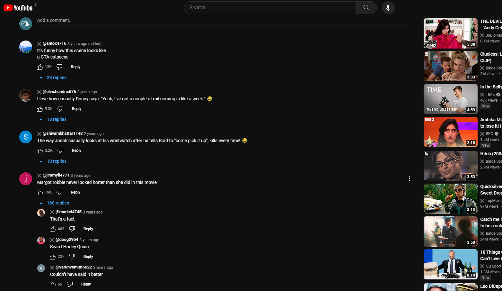
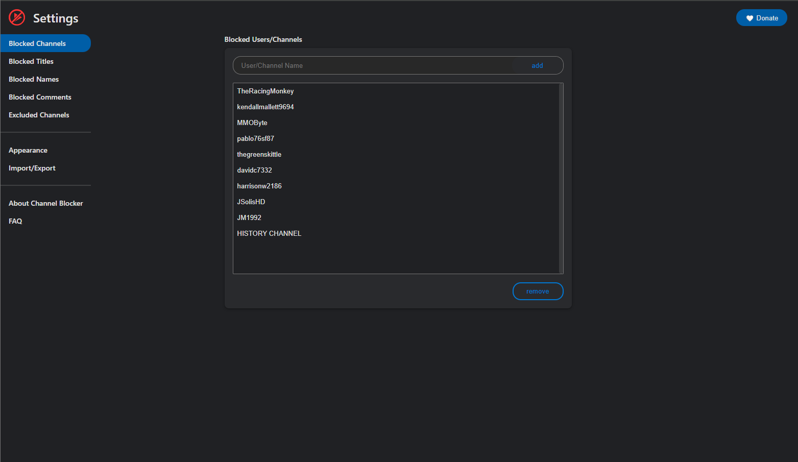

<p align="center"></p>

<h2 align="center"><b>ChannelQuarantine</b></h2>

<p align="center">A maintained Firefox extension that quarantines unwanted YouTube channels, videos, and comments with blocklists or regular expressions.</p>

---

### About this Extension

ChannelQuarantine keeps your YouTube experience clean. Block entire channels, individual videos, or specific commenters with one click, or build powerful blocklists using regular expressions. No user data is collected.

### What's new here?

- Hide sponsored tiles across the YouTube homepage and search results.
- Hide Shorts shelves for a calmer browsing experience.
- Hide news and topic (rich) shelves when you want a trimmed-down feed.

ChannelQuarantine is based on Channel Blocker by Time Machine Development and remains under the BSD 3-Clause license.
This project is maintained by [Hackman238](https://github.com/Hackman238).

---

### Screenshots

<p align="center">
    
    
    
    
</p>

## Getting Started

### Installation

Before you begin, ensure that you have [downloaded and installed Node.js and npm](https://nodejs.org/en/download/).

This repository contains three npm workspaces: `content-scripts`, `service-worker`, and `ui`.

Install all dependencies with:

```
./setup.sh
```

### Building the Extension

Build the complete extension bundle with:

```
./build.sh
```

The build outputs will be written to:

- `dist-firefox/` - Firefox MV2-compatible unpacked build
- `bin/` - zipped Firefox artifact (`ytc.xpi`)

---

### Contributing & Support

Issues and pull requests are welcome at [github.com/Hackman238/ChannelQuarantine](https://github.com/Hackman238/ChannelQuarantine). If you run into problems, please open an issue with steps to reproduce and any relevant console output.
